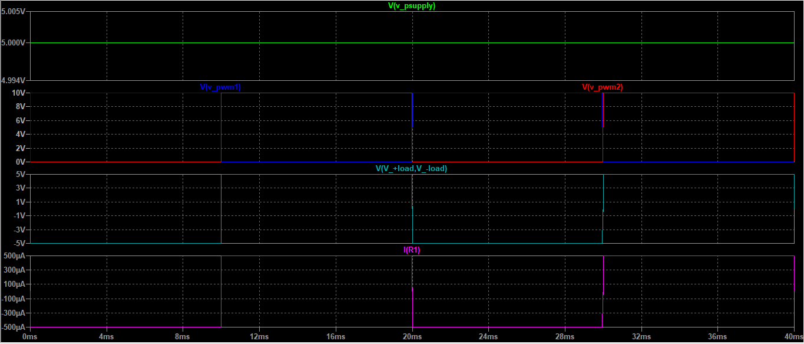
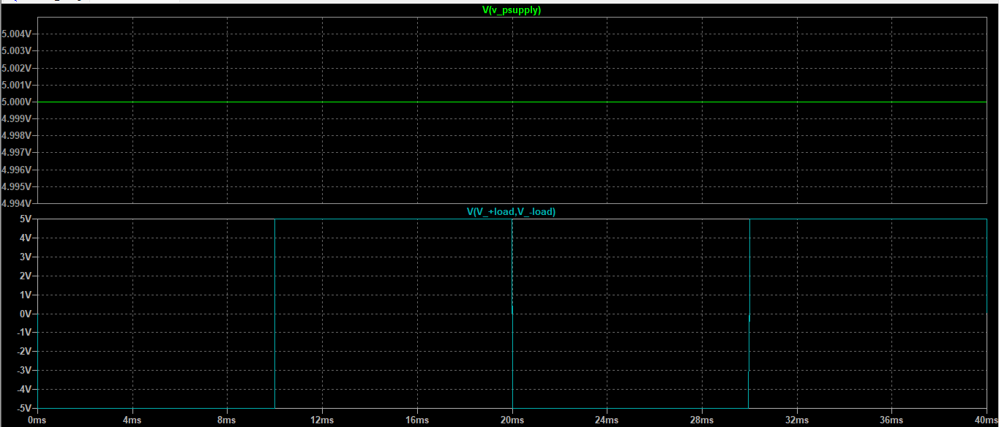

## ⚡ Single-Phase Inverter with Resistive Load (H-Bridge)

As a case study, we will use a full-bridge inverter, also known as an H-Bridge, which supplies a resistive load.

The entire circuit shown below was built in LTspice, and the results were exported here to compare with the theoretical explanations.

To build this circuit, we used four N-channel MOSFET transistors, a DC voltage source with an effective value of 5V, and a 10kΩ resistor. It's worth noting that each MOSFET is driven by its own pulse source for control. This technique, known as PWM (Pulse Width Modulation), will be explained later.

---

🔍 Analysis of the Load

Since our load is purely resistive, as seen in the circuit above, theoretically, the RMS voltage across the load should equal the DC input voltage from the source. However, due to inverter switching, the waveform will be square-shaped. Thus:

> **Vrms_load = Vrms_powersupply**

After simulating the circuit, the results confirm the theory.

As shown in the image above, the voltage source supplies 5V DC. Consequently, the load receives a square wave with the same RMS value of 5V.

A slight distortion or noise can be observed in the waveform across the load. These spikes are primarily caused by the intrinsic capacitances of the MOSFETs and their switching behavior.

As expected, in a purely resistive circuit, the voltage and current waveforms are in phase. Therefore, the current waveform across the load has the same shape as the voltage waveform.

---

### 📐 Harmonic Calculation

Considering the waveform at the load, the peak voltage and RMS voltage of its harmonic components (for a square wave) can be calculated as follows:

Vn_peak = (4 * Vdc) / (n * π), for n = 1, 3, 5, 7, ...

Vn,rms = (4 * Vdc) / (√2)*n * π), for n = 1, 3, 5, 7, ...

---

### 🔁 Inverter Output Voltage and single-pulse PWM 

Since the effective output voltage of the inverter is equal to the input voltage, as shown earlier, how can we vary the inverter's output RMS voltage?

To achieve this, we can use a technique called single-pulse PWM, which consists of modifying the waveform while keeping the input DC voltage constant.

> The waveform is adjusted using the conduction angle (α), which ranges from 0 < α < π/2.

The value of α depends on the desired output. The greater the α, the wider the pulse, meaning the signal stays at a high level (ON) for a longer time.

⚠️ Caution: A larger conduction angle also introduces more harmonics into the output waveform!

For the PWM control signals, an amplitude of 10 V and a period of 20ms (corresponding to a switching frequency of 50 Hz) were used. A duty cycle of 0.5 was applied to the gate signals of MOSFETs M1 and M4.
For M2 and M3, the same parameters were adopted; however, a dead time was introduced between the complementary switching signals to prevent shoot-through conditions in the H-bridge.

Using the .meas function in LTspice, the RMS voltage value was obtained as 4.9934 V, which is very close to the expected 5 V. To test the conduction angle (α) concept, a new simulation was run with a reduced pulse width (Ton = 0.00499 s). In this case, the RMS voltage across the resistor dropped to 3.259 V, and the waveform appeared as a more distorted square wave, confirming the influence of α on the effective output voltage.

---

### 📊 RMS Value of the New Waveform

For the new waveform generated using single-pulse PWM, the RMS voltage of the output can be calculated by:

{Vrms = Vdc * sqrt(1 - (2 * α / π))}

---

### 🎯 Harmonic Calculation for the New Waveform

For the peak voltage and RMS voltage of the harmonic components of this new waveform at the inverter output, we have:

{Vn_peak = (4 * E) / (n * π) * cos(n * α)}

{Vn_rms = (4 * E) / (√2 * n * π) * cos(n * α)}

Where:

- `E` is the input voltage (DC source),
- `n` is the harmonic number (odd only: 1, 3, 5, ...),
- `α` is the conduction angle.

> ℹ️ Note: Depending on the value of α, some harmonics may be canceled.
> Moreover, as α approaches its maximum value (π/2), the RMS voltage tends to zero, and the Total Harmonic Distortion (THD) tends to infinity.
